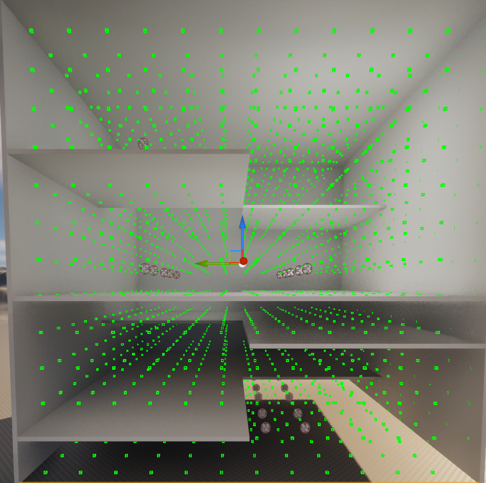
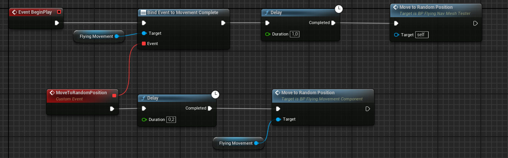

# 3D Navigation Grid for Unreal Engine

This is my first project made during my 3rd semester at [S4G school for Games](https://www.school4games.net/). I created this for our 3rd semester project for flying enemies which sadly didn't make the cut.
But that doesn't stop me from putting it in here and showcasing my work.

---

The grid is a three dimensional array of nodes that get created and validated on start. I wanted to save them as an editable variable but Unreal really struggles with showing arrays in the editor, dropping fps to 5 or less when showing 1.000 or more items, which is unfortunate at best. Therefore the array gets filled on start and after extensive testing I figured it would be no problem. 

The grid visualized:

But this repo does not just include the grid, a movement component handling pathfinding through an A* Algorithm is also included.
This is all the logic inside the navigation tester.

---

## End Note

This project is not complete, as you might have seen I do not use latent actions like the standard unreal "move to" functions but instead just use event dispatchers to check when movement finished
